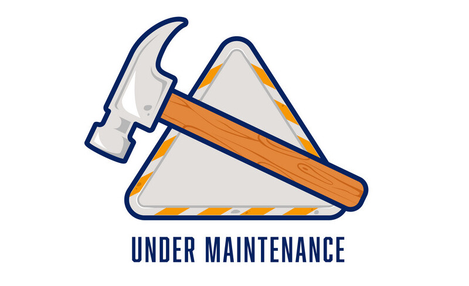

# Hi 🖖! 
I'm Simone and I'm thrilled to have you here on my personal website. I'm not great at writing bios, but I'll give it a shot! 😄 I'm an AI Engineer with a passion for research and software design. When I'm not immersed in writing ~~spaghetti~~ code or reading the newest Python PePs, you can find me playing guitar or reading books to keep the creative juices flowing.

 

# Work Experience

> ## Data Scientist @ [Evoluzione Agency](https://evoluzione.agency)
>  *Part-Time • April 2023 - Oct 2023 • Brescia, Italy*

Worked in R&D on the topics of **Short Text Topic Modeling**, **Query Clustering** and **TimeSeries Forecasting** to develop a tool for SEO management.  

* Development of a proprietary algorithm for short text modeling and clustering addressing several issues of query analysis
* Development of a time series forecasting algorithm using Neural Prophet
* Implementation and Testing of a backend infrastracture using FastAPI and PostgreSQL
* Involved in an Agile Software Development environment.

> ## Computer Vision Engineer @ [Toyota Motor Europe](https://www.toyota-europe.com)
> *Internship • July 2022 - Jan 2023 • Brussels, Belgium*

Worked in TME Autonomated Driving team doing research on the topics of **Novelty Detection** and **Continual Learning** applied to **Autonomous Driving**.  

* Development of a new framework for Novelty/Outlier Detection involving a Continual Learning setting with Human FeedBack
* Implementation and Fine-Tuning of Object Recognition models and Outlier Detection techniques using Detectron2 and PyTorch
* Writing of a conference article
* Article in progress and patent filed.

> ## NLU Researcher @ [SISLab DISI UniTN](https://sisl.disi.unitn.it)
> *Internship • Jan 2022 - June 2022 • Trento, Italy*

Worked on research project about **Knowledge-Aware** Dialogue **Response Generation** applied to mental health domain.  

* Development of Seq2Seq w/ Attention from scratch using PyTorch
* Adaptation and Fine-tuning of T5 (LLM) model on a custom dataset using HuggingFace and PyTorch
* Evaulation of the model under several intrisic metrics (BLEU, F1, simBoW) with the help of Plotly and Weight\&Biases
* Contributed to the development of two workshop articles

# Education

> ## Artificial Intelligence Systems | *MSc*
> *110/110 with Honours • July 2023 • University of Trento, Italy*

Thesis: "Incremental Novelty Detection with FeedBack Loop"

> ## Computer Science & Engineering | *BSc*
> *101/110 • October 2020 • University of Brescia, Italy*

Thesis: "DeepFake: a technological evolution with use cases between threats and opportunities"

# Publications

> ["Response Generation in Longitudinal Dialogues: Which Knowledge Representation Helps?"](https://aclanthology.org/2023.nlp4convai-1.1.pdf). Seyed Mahed Mousavi, Simone Caldarella, Giuseppe Riccardi. **NLP4ConvAI WorkShop @ ACL 2023**

> ["Evaluation of Response Generation Models: Shouldn't It Be Shareable and Replicable?"](https://aclanthology.org/2022.gem-1.12.pdf). Seyed Mahed Mousavi, Gabriel Roccabruna, Michela Lorandi, Simone Caldarella, Giuseppe Riccardi. **GEM WorkShop @ EMNLP 2022**

# Achievements

> ### Chairman
>IEEE Student Branch of Brescia 2018-2019

> ### 2° Place in Italy
>IEEEXtreme 2018 - International Hackathon organised by IEEE

>### Judge and Mentor
>Nasa Space Apps Challenge Brescia 2019

# Skills

>### Tools

[Python](https://www.google.com/search?q=Python) • [Java](https://www.google.com/search?q=Java) • [LaTeX](https://www.google.com/search?q=LaTeX) • [Bash](https://www.google.com/search?q=Bash) • [C](https://www.google.com/search?q=c+programming+language)  

[PyTorch](https://www.google.com/search?q=PyTorch) • [Detectron2](https://www.google.com/search?q=Detectron2) • [HuggingFace](https://www.google.com/search?q=HuggingFace) • [SpaCy](https://www.google.com/search?q=SpaCy) • [Scikit-Learn](https://www.google.com/search?q=Scikit-Learn) • [NLTK](https://www.google.com/search?q=NLTK) • [OpenCV](https://www.google.com/search?q=OpenCV) • [NeuralProphet](https://www.google.com/search?q=neural+prophet) • [Pandas](https://www.google.com/search?q=Pandas) • [Plotly](https://www.google.com/search?q=Plotly) • [NumPy](https://www.google.com/search?q=NumPy) • [AIM](https://www.google.com/search?q=AIM) • [TensorBoard](https://www.google.com/search?q=TensorBoard) • [Weight&Biases](https://www.google.com/search?q=weight+%26+biases)   

[FastAPI](https://www.google.com/search?q=FastAPI) • [PostgreSQL](https://www.google.com/search?q=PostgreSQL) • [Psycopg2](https://www.google.com/search?q=Psycopg2) • [UnitTest](https://www.google.com/search?q=UnitTest+python) • [Jekyll](https://www.google.com/search?q=jekyll+static+website) • [Git](https://www.google.com/search?q=git) • [GitFlow](https://www.google.com/search?q=gitflow) • [Github](https://www.google.com/search?q=github) • [Jira](https://www.google.com/search?q=jira+agile) • [Excel](https://www.google.com/search?q=excel)

> ### Topics

[ArtificialIntelligence](https://www.google.com/search?q=artificial+intelligence) • [DeepLearning](https://www.google.com/search?q=deep+learning) • [ComputerVision](https://www.google.com/search?q=computer+vision) • [NLP](https://www.google.com/search?q=natural+language+processing) • [LLMs](https://www.google.com/search?q=LLMs) • [DialogueGeneration](https://www.google.com/search?q=dialogue+generation) • [ContinualLearning](https://www.google.com/search?q=continual+learning) • [AnomalyDetection](https://www.google.com/search?q=anomaly+detection) • [QuantumMachineLearning](https://www.google.com/search?q=quantum+machine+learning)  

[DataScience](https://www.google.com/search?q=datascience) •  [SoftwareEngineering](https://www.google.com/search?q=software+engineering) • [SoftwareDesign](https://www.google.com/search?q=software+design) • [TDD](https://www.google.com/search?q=test+driven+development) • [Agile](https://www.google.com/search?q=agile)

# Contacts
<dl>
<dt>Email</dt>
<dd><a href= "mailto:simone.caldarella98@gmail.com">simone.caldarella98@gmail.com</a></dd>
<dt>LinkedIn</dt>
<dd><a href= "https://www.linkedin.com/in/simone-caldarella-16930b16a/">Personal Account</a></dd>
<dt>Github</dt>
<dd><a href= "https://github.com/SimoneCaldarella/">@SimoneCaldarella</a></dd>
<dt>Blog</dt>
<dd><a href= "https://lifeofaprocrastinator.github.io/">Loap-Project</a></dd>
</dl>

<!---

# Projects

<head>

</head>

<a href="./another-page.html">
      

  

  
 Test project 1

  

  </a>

--->

